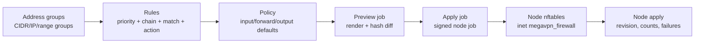

# Firewall Policy Catalog

**Release:** `7.1.1.11`

Firewall is the managed policy workspace for node and control-plane boundaries.
It is intentionally modeled as a catalog before apply: operators prepare address
groups, ordered rules and policies, then queue an apply job for a selected
node.

Russian companion: [FIREWALL_RU.md](FIREWALL_RU.md).

## Operating Model

Use the firewall as a catalog-to-apply pipeline:



The operator workflow is:

1. Create reusable address groups for operators, trusted networks, VPN pools or
   blocked destinations.
2. Add entries to address groups. Leave type on auto-detect for CIDR, single IP
   or IP range entries.
3. Create ordered rules inside a policy. Lower priority is evaluated first.
4. Run `Preview` for the selected node. Preview renders the same nftables
   payload as apply, but it does not create a revision or change desired node
   state.
5. Review the diff: current observed node hash versus preview hash, warnings
   and the rendered nftables script.
6. Only then run `Apply` and watch the node firewall state.

This keeps editing separate from rollout. A catalog change does not alter a node
until an apply job is queued and completed.

Read every rule left to right:

```text
priority -> chain -> source/destination match -> protocol/ports/state -> action
```

`input` protects services listening on the node, `forward` protects routed VPN
or backhaul traffic through the node, and `output` protects traffic originated
by the node itself.

Existing installations upgraded from an earlier `7.0.1` build must run database
migrations through `000009_firewall_schema_repair` before creating address
lists. If migrations are behind, the API can return
`relation "firewall_address_lists" does not exist`.

## Semantic Address Groups

The default seed creates semantic groups with explicit operational meaning.
They must not be replaced by one generic `whitelist`:

| Group | Purpose |
| --- | --- |
| `trusted_control_plane` | Control-plane sources for agent management and SSH bootstrap. |
| `trusted_operators` | Operator/admin source ranges for privileged node access. |
| `vpn_client_sources` | Managed VPN client ranges allowed to route traffic. |
| `backhaul_sources` | Ingress-to-egress tunnel and backhaul ranges. |
| `public_service_sources` | Public or restricted sources for service listeners. |
| `blocked_destinations` | Reusable deny/quarantine destination ranges. |

DNS entries in these groups are catalog context only. Active nftables matchers
are built from IP, CIDR and IP range entries. Strict preview/apply blocks an
`accept` rule when the referenced group is active but has no renderable entry.

## Management Source Configuration

Strict firewall rollout is fail-closed around management access. Configure
management source CIDRs before applying strict input/output defaults:

| Setting | Source | Purpose |
| --- | --- | --- |
| Control-plane source CIDRs | `MEGAVPN_CP_FIREWALL_SOURCE_CIDRS`, `Settings -> Firewall safety` | Sources allowed to manage nodes and seed `trusted_control_plane`. |
| SSH bootstrap source CIDRs | `MEGAVPN_CP_SSH_BOOTSTRAP_SOURCE_CIDRS`, `Settings -> Firewall safety` | Additional sources allowed for node SSH bootstrap. |
| Trusted operator CIDRs | `Settings -> Firewall safety` | Human/admin source ranges seeded into `trusted_operators`. |

Values must be explicit IP addresses or CIDRs. DNS names are ignored for nft set
rendering, and `0.0.0.0/0` or `::/0` are rejected for automatic SSH safety.
This prevents the platform from silently generating SSH-from-any rules.

On API startup the configured control-plane and SSH-bootstrap CIDRs are seeded
into semantic firewall groups. On preview/apply the selected policy is validated
against those rendered groups and the agent adds system safety rules only from
trusted semantic groups.

## UI Workflow

Open `Firewall` from the control menu.

- `Overview`: counters and posture.
- `Policies`: policy cards, default chain metadata, preview and apply.
- `Rules`: global ordered rule view.
- `Address groups`: group and entry management.
- `Node apply`: last apply state per node, row-scoped preview/apply/disable.

The top workflow buttons jump directly to the required stage. The rule editor
contains presets for SSH management, HTTPS control, WireGuard, OpenVPN
TCP/UDP, IPsec IKE/NAT-T, L2TP, Shadowsocks TCP/UDP, HTTP proxy, MTProto,
Nginx edge HTTP(S) and invalid-packet drop.

The `Policies` view shows each policy posture, default input/forward/output
actions and a short rule preview. The `Rules` view includes local filters for
policy, chain, action and text search across CIDR/list/port/comment fields.
The `Address groups` view includes local search across group metadata and entry
values. The top table manages named groups; the second table shows concrete
entries inside those groups.

The built-in `Default node firewall` policy is the recommended minimal
baseline for production nodes. In strict mode it denies unsolicited input and
forwarded traffic, keeps node output at `accept`, allows IPv4/IPv6 diagnostics,
allows public HTTP/HTTPS edge entrypoints and permits forwarding for the seeded
private/CGNAT/ULA client source ranges in `vpn_client_sources`.

The default baseline is intentionally small:

| Priority | Chain | Action | Match | Purpose |
| --- | --- | --- | --- | --- |
| 50 | input | drop | invalid state | Drop malformed tracked input packets. |
| 55 | forward | drop | invalid state | Drop malformed forwarded packets. |
| 100 | input | accept | ICMP | Keep IPv4 diagnostics available. |
| 105 | input | accept | ICMPv6 | Keep IPv6 diagnostics and neighbor behavior available. |
| 120 | input | accept | TCP 80,443 | Allow public HTTP/HTTPS edge entrypoints. |
| 200 | input | accept | SSH from `trusted_operators` | Disabled until the trusted operator list is populated. |
| 300 | forward | accept | `vpn_client_sources` | Allow managed VPN clients to route through the node. |

The SSH rule is present but disabled until `trusted_operators` is populated and
the operator deliberately enables it. Protocol listener ports beyond HTTP/HTTPS
should be added only for services that are actually installed, using rule
presets or service-specific policy.

The apply dialog is split into two explicit modes:

- `Rules only`: base chains stay at `accept`; explicit catalog rules are
  installed.
- `Strict defaults`: default input/forward/output policies are enforced by the
  agent.

`Node apply` shows the last observed enforcement mode, explicit rule count and
system safety rule count returned by the agent. `applied` means the selected
node has accepted and installed the managed firewall payload. `disabled` means
the node has removed the managed firewall table and no policy/revision is
currently attached to that node.

The preview dialog uses the same modes. Its result shows:

- `Preview hash`: the rendered policy hash the agent would apply.
- `Current hash`: the last observed node hash from `firewall_node_state`.
- `Diff`: `No changes`, `Changes pending` or `Not applied yet`.
- `SSH bootstrap`: whether strict input preserves node SSH from trusted
  management sources.
- `Control-plane egress`: whether strict output preserves agent-to-control
  plane communication.
- `Forward traffic`: whether strict forward preserves active VPN/backhaul
  traffic paths for nodes that need forwarding.
- `Address groups`: renderable IP/CIDR/range entry count and ignored DNS-only
  entry count.
- `Rendered nftables script`: an expandable script for operator review.

`Apply this policy` is shown only after a successful preview with a valid
rendered hash and preserves the selected `Rules only` or `Strict defaults`
mode.

For `Strict defaults`, preview is also a backend gate: `Apply` is accepted only
after a successful `node.firewall.preview` for the same node, policy, rules,
address groups and `safety_mode=strict`. If an operator changes a rule or
address group after preview, the payload hash changes and apply must be
previewed again.

`Disable` queues `node.firewall.disable` for the selected node. It deletes only
the managed `inet megavpn_firewall` nftables table and leaves instances,
backhaul, route policy and service runtimes untouched. Use it for staged
rollback or emergency firewall removal. To enable firewall again, run Preview
and Apply for the intended policy.

SSH bootstrap and agent reinstall/update use inbound SSH from the control plane
to the node. When a node has an applied `Strict defaults` firewall, bootstrap is
blocked before job creation unless the active policy can preserve the configured
SSH port from `trusted_control_plane` or `trusted_operators`. The policy may
contain an explicit source-scoped input accept rule, or strict apply may render
the managed system SSH rule from configured management CIDRs. Disable the
managed firewall first, or populate the management CIDRs/groups and re-apply
the policy.

A generic `whitelist` does not satisfy SSH bootstrap safety by itself. The
source rule must reference `trusted_control_plane`, `trusted_operators` with
active IP/CIDR/range entries, or an explicit control-plane CIDR. SSH-from-any
is never generated automatically.

## Security Model

- `firewall.read` allows inspection.
- `firewall.manage` allows policy, rule and address-group changes.
- `firewall.apply` allows queueing node preview/apply/disable jobs.
- All create/update/delete/preview/apply/disable actions produce audit events.
- Rules are stored as catalog data and rendered by the worker into managed node
  firewall payloads.

## Enforcement Boundary

By default, apply jobs install explicit allow/drop/reject rules into managed
nftables chains while keeping base chain policy at `accept`. This is the safe
staging mode for first rollout and catalog validation.

Strict default-policy enforcement is available per apply job through the
`enforce_default_policy` flag in the API/UI. In strict mode the agent replaces
the managed `inet megavpn_firewall` table atomically with `nft -f`, recreates
input, forward and output base chains and applies the policy defaults:

- `accept` is rendered as base chain policy `accept`.
- `drop` is rendered as base chain policy `drop`.
- `reject` is rendered as base chain policy `drop` plus a terminal `reject`
  rule, because nftables base chain policy does not support `reject`.

The agent also adds system safety rules for established/related traffic and
loopback before catalog rules.

If input default policy is `drop` or `reject`, strict preview/apply requires at
least one renderable management source in `trusted_control_plane` or
`trusted_operators` and renders a system SSH allow rule for the node SSH port.
Broad any-source management entries are never generated automatically.

If forward default policy is `drop` or `reject`, strict preview/apply checks
whether the node has an active VPN, backhaul or egress role. Nodes that require
forwarding must have an active forward allow path from `vpn_client_sources` or
`backhaul_sources`; otherwise preview/apply is blocked before node rollout.

If output default policy is `drop` or `reject`, the agent must preserve
control-plane egress. It does this by either:

- generating a TCP egress allow rule when the agent control-plane URL host is
  an IP address; or
- accepting an explicit active catalog `output accept` rule for the
  control-plane TCP port when the control-plane URL host is DNS.

The Control Plane also rejects strict output apply when the configured
control-plane endpoint is DNS-only and no explicit output CIDR/list rule exists.
If neither condition is true, render fails before touching nftables. This keeps
strict output rollout from silently isolating a node.

Preview/apply results expose the safety outcome explicitly:

| Field | Meaning |
| --- | --- |
| `ssh_bootstrap_preserved` | Strict input keeps SSH bootstrap reachable from trusted management CIDRs. |
| `control_plane_egress_preserved` | Strict output keeps agent egress to the Control Plane reachable. |
| `forward_egress_preserved` | Strict forward keeps required VPN/backhaul forwarding paths reachable, or the node does not require forwarding. |
| `address_group_rendered_entry_count` | IP/CIDR/range entries rendered into nft sets. |
| `address_group_ignored_dns_entry_count` | DNS-only entries kept as catalog metadata and ignored by nft rendering. |

Address-group entries with DNS type are stored for catalog context only in this
release. Node-side nftables apply renders CIDR, single IP address and IP range
entries; a DNS-only list cannot be used as an active rule matcher. The rule
protocol model supports `any`, `tcp`, `udp`, `icmp` and `icmpv6`.

Preview/apply results include address-group counts, including ignored DNS
entries. This gives operators audit evidence for what actually entered nft sets
and what remained metadata only.

The managed table is owned by MegaVPN. Do not place hand-written rules in
`inet megavpn_firewall`; strict apply replaces that table as a single managed
unit. Route-policy and service-policy chains continue to use `inet megavpn`;
firewall apply cleans legacy `firewall_*` chains from that shared table without
deleting the table.

## Failure Handling

If apply fails:

1. Open `Firewall -> Node apply`.
2. Find the failed node and last policy.
3. Open `Jobs` for the corresponding `node.firewall.apply` job.
4. Check agent logs and rendered payload details.
5. Fix the catalog rule and queue apply again.

Do not make persistent node-side firewall changes outside the managed catalog.
Temporary emergency access changes must be documented and then converted into a
managed policy rule.
