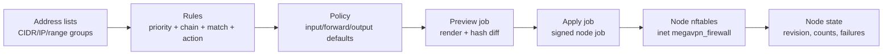

# Каталог firewall-политик

**Релиз:** `7.1.0.16`

Firewall - это managed workspace для границ control-plane и node. Он специально
сделан как каталог перед применением: оператор готовит address lists,
упорядоченные rules и policies, затем ставит apply job на выбранную node.

English companion: [FIREWALL.md](FIREWALL.md).

## Операционная модель

Firewall надо воспринимать как pipeline от каталога до node apply:



Рабочий порядок оператора:

1. Создать reusable address lists для операторов, доверенных сетей, VPN-пулов
   или заблокированных destinations.
2. Добавить entries в address lists. Тип можно оставить auto-detect для CIDR,
   одиночного IP или IP range.
3. Создать ordered rules внутри policy. Меньший priority применяется раньше.
4. Запустить `Preview` для выбранной node. Preview рендерит тот же nftables
   payload, что и apply, но не создает revision и не меняет desired node state.
5. Проверить diff: текущий observed hash node против preview hash, warnings и
   rendered nftables script.
6. Только после этого нажать `Apply` и проверить node firewall state.

Так редактирование отделено от rollout. Изменение каталога не меняет node, пока
apply job не поставлен в очередь и не завершился.

Каждое правило читается слева направо:

```text
priority -> chain -> source/destination match -> protocol/ports/state -> action
```

`input` защищает сервисы, которые слушают на node, `forward` защищает
маршрутизируемый VPN/backhaul traffic через node, а `output` защищает traffic,
который инициирует сама node.

Инсталляции, обновленные с более раннего `7.0.1`, должны выполнить database
migrations до `000009_firewall_schema_repair` перед созданием address lists.
Если миграции не применены, API может вернуть
`relation "firewall_address_lists" does not exist`.

## Workflow в UI

Откройте `Firewall` в control menu.

- `Overview`: счетчики и общий posture.
- `Policies`: карточки policy, metadata default chain, preview и apply.
- `Rules`: общий список правил по priority.
- `Address lists`: управление lists и entries.
- `Node state`: последнее состояние apply по каждой node, быстрый preview/apply.

Верхние workflow-кнопки переключают на нужный этап. В редакторе правил есть
presets для SSH management, HTTPS control, WireGuard, OpenVPN TCP/UDP, IPsec
IKE/NAT-T, L2TP, Shadowsocks TCP/UDP, HTTP proxy, MTProto, Nginx edge HTTP(S)
и drop invalid packets.

Вкладка `Policies` показывает posture каждой policy, default
input/forward/output actions и короткий preview правил. Вкладка `Rules`
содержит локальные filters по policy, chain, action и текстовый поиск по
CIDR/list/port/comment fields. Вкладка `Address lists` содержит локальный поиск
по metadata list и values entries.

Встроенная policy `Default node firewall` - рекомендуемый минимальный baseline
для production nodes. В strict mode она запрещает незапрошенный input и
forwarded traffic, оставляет node output в `accept`, разрешает IPv4/IPv6
diagnostics, публичные HTTP/HTTPS edge entrypoints и forwarding для seeded
private/CGNAT/ULA client source ranges из `vpn_client_sources`.

Default baseline специально небольшой:

| Priority | Chain | Action | Match | Зачем нужно |
| --- | --- | --- | --- | --- |
| 50 | input | drop | invalid state | Отбрасывает некорректный tracked input traffic. |
| 55 | forward | drop | invalid state | Отбрасывает некорректный forwarded traffic. |
| 100 | input | accept | ICMP | Оставляет IPv4 diagnostics. |
| 105 | input | accept | ICMPv6 | Оставляет IPv6 diagnostics и neighbor behavior. |
| 120 | input | accept | TCP 80,443 | Разрешает публичные HTTP/HTTPS edge entrypoints. |
| 200 | input | accept | SSH from `trusted_operators` | Выключено, пока не заполнен trusted operator list. |
| 300 | forward | accept | `vpn_client_sources` | Разрешает managed VPN clients маршрутизироваться через node. |

SSH rule присутствует, но выключен до тех пор, пока `trusted_operators` не
заполнен и оператор явно не включит правило. Listener-порты протоколов кроме
HTTP/HTTPS нужно добавлять только для реально установленных сервисов через rule
presets или service-specific policy.

Apply dialog разделен на два явных режима:

- `Rules only`: base chains остаются в `accept`; устанавливаются explicit
  catalog rules.
- `Strict defaults`: agent применяет default input/forward/output policies.

`Node state` показывает последний observed enforcement mode, число explicit
rules и число system safety rules, которые вернул agent.

Preview dialog использует те же режимы. Результат показывает:

- `Preview hash`: hash рендера, который agent применит при apply.
- `Current hash`: последний observed hash node из `firewall_node_state`.
- `Diff`: `No changes`, `Changes pending` или `Not applied yet`.
- `Rendered nftables script`: раскрываемый script для operator review.

Кнопка `Apply this policy` появляется только после успешного preview с
валидным rendered hash и сохраняет выбранный режим `Rules only` или
`Strict defaults`.

## Security model

- `firewall.read` разрешает просмотр.
- `firewall.manage` разрешает менять policies, rules и address lists.
- `firewall.apply` разрешает ставить node preview/apply jobs.
- Все create/update/delete/preview/apply действия пишут audit events.
- Rules хранятся как catalog data и рендерятся worker-ом в managed firewall
  payload для node.

## Граница enforcement

По умолчанию apply job устанавливает explicit allow/drop/reject rules в managed
nftables chains, но оставляет base chain policy в `accept`. Это безопасный
staging mode для первого rollout и проверки каталога.

Strict default-policy enforcement доступен на каждый apply job через флаг
`enforce_default_policy` в API/UI. В strict mode agent атомарно заменяет
managed table `inet megavpn_firewall` через `nft -f`, пересоздает input,
forward и output base chains и применяет default policies:

- `accept` рендерится как base chain policy `accept`.
- `drop` рендерится как base chain policy `drop`.
- `reject` рендерится как base chain policy `drop` плюс terminal `reject`
  rule, потому что nftables base chain policy не поддерживает `reject`.

Agent также добавляет system safety rules для established/related traffic и
loopback перед catalog rules. Если output default policy равен `drop` или
`reject`, agent должен сохранить control-plane egress. Для этого он:

- генерирует TCP egress allow rule, если host control-plane URL у agent задан
  IP-адресом; или
- принимает explicit active catalog rule `output accept` для TCP-порта
  control-plane, если host control-plane URL задан DNS-именем.

Если ни одно условие не выполнено, render завершается ошибкой до изменения
nftables. Это защищает strict output rollout от тихой изоляции node.

DNS entries в address lists в этом релизе хранятся только как catalog context.
Node-side nftables apply рендерит CIDR, одиночные IP-адреса и IP ranges;
DNS-only list нельзя использовать как active matcher в rule. Модель protocol
для rules поддерживает `any`, `tcp`, `udp`, `icmp` и `icmpv6`.

Managed table принадлежит MegaVPN. Не размещайте hand-written rules в
`inet megavpn_firewall`; strict apply заменяет эту table как единый managed
unit. Route-policy и service-policy chains продолжают использовать
`inet megavpn`; firewall apply чистит legacy `firewall_*` chains из этой общей
table без удаления самой table.

## Обработка ошибок

Если apply завершился ошибкой:

1. Откройте `Firewall -> Node state`.
2. Найдите failed node и последнюю policy.
3. Откройте `Jobs` для соответствующего `node.firewall.apply`.
4. Проверьте agent logs и rendered payload details.
5. Исправьте catalog rule и повторите apply.

Не делайте постоянные node-side firewall изменения вне managed catalog.
Временные emergency changes надо задокументировать и затем перенести в managed
policy rule.
