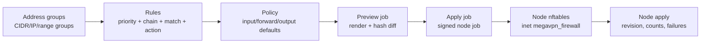

# Каталог firewall-политик

**Релиз:** `7.1.1.13`

Firewall - это managed workspace для границ control-plane и node. Он специально
сделан как каталог перед применением: оператор готовит address groups,
упорядоченные rules и policies, затем ставит apply job на выбранную node.

English companion: [FIREWALL.md](FIREWALL.md).

## Операционная модель

Firewall надо воспринимать как pipeline от каталога до node apply:



Рабочий порядок оператора:

1. Создать reusable address groups для операторов, доверенных сетей, VPN-пулов
   или заблокированных destinations.
2. Добавить entries в address groups. Тип можно оставить auto-detect для CIDR,
   одиночного IP или IP range.
3. Создать ordered rules внутри policy. Меньший priority применяется раньше.
4. Запустить `Preview` для выбранной node. Preview рендерит тот же nftables
   payload, что и apply, но не создает revision и не меняет desired node state.
5. Проверить diff: текущий observed hash node против preview hash, warnings и
   rendered nftables script.
6. Только после этого нажать `Apply` и проверить node firewall state.

Так редактирование отделено от rollout. Изменение каталога не меняет node, пока
apply job не поставлен в очередь и не завершился.

Каждое правило читается слева направо:

```text
priority -> chain -> source/destination match -> protocol/ports/state -> action
```

`input` защищает сервисы, которые слушают на node, `forward` защищает
маршрутизируемый VPN/backhaul traffic через node, а `output` защищает traffic,
который инициирует сама node.

Инсталляции, обновленные с более раннего `7.0.1`, должны выполнить database
migrations до `000009_firewall_schema_repair` перед созданием address groups.
Если миграции не применены, API может вернуть
`relation "firewall_address_lists" does not exist`.

## Semantic address groups

Default seed создает semantic groups, которые имеют операционный смысл и не
должны заменяться одной общей `whitelist`:

| Group | Назначение |
| --- | --- |
| `trusted_control_plane` | Control-plane sources для agent management и SSH bootstrap. |
| `trusted_operators` | Operator/admin source ranges для привилегированного node access. |
| `vpn_client_sources` | Managed VPN client ranges, которым разрешен routed traffic. |
| `backhaul_sources` | Ingress-to-egress tunnel/backhaul ranges. |
| `public_service_sources` | Public or restricted sources для service listeners. |
| `blocked_destinations` | Reusable deny/quarantine destination ranges. |

DNS entries в этих groups являются только catalog context. Active nftables
matchers строятся из IP, CIDR и IP range. Strict preview/apply блокирует
`accept` rule, если referenced group active, но не имеет ни одной renderable
entry.

## Настройка management sources

Strict firewall rollout работает fail-closed вокруг management access. До
применения strict input/output defaults настройте management source CIDRs:

| Настройка | Источник | Назначение |
| --- | --- | --- |
| Control-plane source CIDRs | `MEGAVPN_CP_FIREWALL_SOURCE_CIDRS`, `Settings -> Firewall safety` | Sources, которым разрешено управлять nodes; seed для `trusted_control_plane`. |
| SSH bootstrap source CIDRs | `MEGAVPN_CP_SSH_BOOTSTRAP_SOURCE_CIDRS`, `Settings -> Firewall safety` | Дополнительные sources для SSH bootstrap на nodes. |
| Trusted operator CIDRs | `Settings -> Firewall safety` | Admin/operator ranges, которые seed-ятся в `trusted_operators`. |

Значения должны быть явными IP-адресами или CIDR. DNS names игнорируются при
рендере nft sets, а `0.0.0.0/0` и `::/0` отклоняются для автоматической SSH
safety. Это не дает платформе незаметно создать SSH-from-any rule.

При старте API настроенные control-plane и SSH-bootstrap CIDRs seed-ятся в
semantic firewall groups. На preview/apply выбранная policy валидируется против
этих rendered groups, а agent добавляет system safety rules только из trusted
semantic groups.

## Workflow в UI

Откройте `Firewall` в control menu.

- `Overview`: счетчики и общий posture.
- `Policies`: карточки policy, metadata default chain, preview и apply.
- `Rules`: общий список правил по priority.
- `Address groups`: управление groups и entries.
- `Node apply`: последнее состояние apply по каждой node, row-scoped preview/apply/disable.

Верхние workflow-кнопки переключают на нужный этап. В редакторе правил есть
presets для SSH management, HTTPS control, WireGuard, OpenVPN TCP/UDP, IPsec
IKE/NAT-T, L2TP, Shadowsocks TCP/UDP, HTTP proxy, MTProto, Nginx edge HTTP(S)
и drop invalid packets.

Вкладка `Policies` показывает posture каждой policy, default
input/forward/output actions и короткий preview правил. Вкладка `Rules`
содержит локальные filters по policy, chain, action и текстовый поиск по
CIDR/list/port/comment fields. Вкладка `Address groups` содержит локальный
поиск по metadata group и values entries. Верхняя таблица управляет named
groups, вторая таблица показывает concrete entries внутри этих groups.

Встроенная policy `Default node firewall` - рекомендуемый минимальный baseline
для production nodes. В strict mode она запрещает незапрошенный input и
forwarded traffic, оставляет node output в `accept`, разрешает IPv4/IPv6
diagnostics, публичные HTTP/HTTPS edge entrypoints и forwarding для seeded
private/CGNAT/ULA client source ranges из `vpn_client_sources`.

Default baseline специально небольшой:

| Priority | Chain | Action | Match | Зачем нужно |
| --- | --- | --- | --- | --- |
| 50 | input | drop | invalid state | Отбрасывает некорректный tracked input traffic. |
| 55 | forward | drop | invalid state | Отбрасывает некорректный forwarded traffic. |
| 100 | input | accept | ICMP | Оставляет IPv4 diagnostics. |
| 105 | input | accept | ICMPv6 | Оставляет IPv6 diagnostics и neighbor behavior. |
| 120 | input | accept | TCP 80,443 | Разрешает публичные HTTP/HTTPS edge entrypoints. |
| 200 | input | accept | SSH from `trusted_operators` | Выключено, пока не заполнен trusted operator list. |
| 300 | forward | accept | `vpn_client_sources` | Разрешает managed VPN clients маршрутизироваться через node. |

SSH rule присутствует, но выключен до тех пор, пока `trusted_operators` не
заполнен и оператор явно не включит правило. Listener-порты протоколов кроме
HTTP/HTTPS нужно добавлять только для реально установленных сервисов через rule
presets или service-specific policy.

Apply dialog разделен на два явных режима:

- `Rules only`: base chains остаются в `accept`; устанавливаются explicit
  catalog rules.
- `Strict defaults`: agent применяет default input/forward/output policies.

`Node apply` показывает последний observed enforcement mode, число explicit
rules и число system safety rules, которые вернул agent. `applied` означает,
что выбранная node приняла и установила managed firewall payload. `disabled`
означает, что node удалила managed firewall table и к node сейчас не привязаны
policy/revision.

Preview dialog использует те же режимы. Результат показывает:

- `Preview hash`: hash рендера, который agent применит при apply.
- `Current hash`: последний observed hash node из `firewall_node_state`.
- `Diff`: `No changes`, `Changes pending` или `Not applied yet`.
- `SSH bootstrap`: сохраняет ли strict input доступ по SSH от trusted
  management sources.
- `Control-plane egress`: сохраняет ли strict output связь agent с Control
  Plane.
- `Forward traffic`: сохраняет ли strict forward активные VPN/backhaul traffic
  paths для nodes, которым нужен forwarding.
- `Address groups`: сколько IP/CIDR/range entries реально рендерится и сколько
  DNS-only entries игнорируется.
- `Rendered nftables script`: раскрываемый script для operator review.

Кнопка `Apply this policy` появляется только после успешного preview с
валидным rendered hash и сохраняет выбранный режим `Rules only` или
`Strict defaults`.

Для `Strict defaults` preview является обязательным backend-gate: `Apply`
принимается только после successful `node.firewall.preview` для той же node,
policy, rules, address groups и `safety_mode=strict`. Если operator изменил
rule/address group после preview, payload hash меняется, и apply надо
перепроверить через новый preview.

`Disable` ставит `node.firewall.disable` для выбранной node. Он удаляет только
managed nftables table `inet megavpn_firewall` и не трогает instances,
backhaul, route policy и service runtimes. Используйте это для staged rollback
или emergency firewall removal. Чтобы включить firewall снова, выполните
Preview и Apply нужной policy.

SSH bootstrap и reinstall/update агента используют входящий SSH от control
plane к node. Если на node применен firewall в режиме `Strict defaults`,
bootstrap блокируется до создания job, пока active policy не может сохранить
настроенный SSH-порт от `trusted_control_plane` или `trusted_operators`.
Policy может содержать explicit source-scoped input accept rule, либо strict
apply может отрендерить managed system SSH rule из настроенных management
CIDRs. Сначала отключите managed firewall или заполните management CIDRs/groups
и примените policy повторно.

Generic `whitelist` сама по себе не считается SSH bootstrap safety. Source rule
должен ссылаться на `trusted_control_plane`, `trusted_operators` с активными
IP/CIDR/range entries либо на explicit control-plane CIDR. SSH-from-any не
генерируется автоматически.

## Security model

- `firewall.read` разрешает просмотр.
- `firewall.manage` разрешает менять policies, rules и address groups.
- `firewall.apply` разрешает ставить node preview/apply/disable jobs.
- Все create/update/delete/preview/apply/disable действия пишут audit events.
- Rules хранятся как catalog data и рендерятся worker-ом в managed firewall
  payload для node.

## Граница enforcement

По умолчанию apply job устанавливает explicit allow/drop/reject rules в managed
nftables chains, но оставляет base chain policy в `accept`. Это безопасный
staging mode для первого rollout и проверки каталога.

Strict default-policy enforcement доступен на каждый apply job через флаг
`enforce_default_policy` в API/UI. В strict mode agent атомарно заменяет
managed table `inet megavpn_firewall` через `nft -f`, пересоздает input,
forward и output base chains и применяет default policies:

- `accept` рендерится как base chain policy `accept`.
- `drop` рендерится как base chain policy `drop`.
- `reject` рендерится как base chain policy `drop` плюс terminal `reject`
  rule, потому что nftables base chain policy не поддерживает `reject`.

Agent также добавляет system safety rules для established/related traffic и
loopback перед catalog rules.

Если input default policy равен `drop` или `reject`, strict preview/apply
требует хотя бы один renderable management source в `trusted_control_plane` или
`trusted_operators` и рендерит system SSH allow rule для SSH-порта node. Broad
any-source management entries автоматически никогда не генерируются.

Если forward default policy равен `drop` или `reject`, strict preview/apply
проверяет, есть ли у node активная VPN, backhaul или egress role. Node, которой
нужен forwarding, обязана иметь active forward allow path из
`vpn_client_sources` или `backhaul_sources`; иначе preview/apply блокируется до
rollout на node.

Если output default policy равен `drop` или `reject`, agent должен сохранить
control-plane egress. Для этого он:

- генерирует TCP egress allow rule, если host control-plane URL у agent задан
  IP-адресом; или
- принимает explicit active catalog rule `output accept` для TCP-порта
  control-plane, если host control-plane URL задан DNS-именем.

Control Plane также отклоняет strict output apply, если control-plane endpoint
настроен только DNS-именем и нет explicit output CIDR/list rule. Если ни одно
условие не выполнено, render завершается ошибкой до изменения nftables. Это
защищает strict output rollout от тихой изоляции node.

Preview/apply result явно показывает safety outcome:

| Field | Значение |
| --- | --- |
| `ssh_bootstrap_preserved` | Strict input сохраняет SSH bootstrap от trusted management CIDRs. |
| `control_plane_egress_preserved` | Strict output сохраняет egress agent к Control Plane. |
| `forward_egress_preserved` | Strict forward сохраняет нужные VPN/backhaul forwarding paths или node не требует forwarding. |
| `address_group_rendered_entry_count` | IP/CIDR/range entries, отрендеренные в nft sets. |
| `address_group_ignored_dns_entry_count` | DNS-only entries, оставленные как catalog metadata и проигнорированные nft rendering. |

DNS entries в address groups в этом релизе хранятся только как catalog context.
Node-side nftables apply рендерит CIDR, одиночные IP-адреса и IP ranges;
DNS-only list нельзя использовать как active matcher в rule. Модель protocol
для rules поддерживает `any`, `tcp`, `udp`, `icmp` и `icmpv6`.

Preview/apply result возвращает counts по address groups, включая ignored DNS
entries. Это нужно для аудита: оператор видит, какие значения реально попали в
nft set, а какие оставлены только как справочная metadata.

Managed table принадлежит MegaVPN. Не размещайте hand-written rules в
`inet megavpn_firewall`; strict apply заменяет эту table как единый managed
unit. Route-policy и service-policy chains продолжают использовать
`inet megavpn`; firewall apply чистит legacy `firewall_*` chains из этой общей
table без удаления самой table.

## Обработка ошибок

Если apply завершился ошибкой:

1. Откройте `Firewall -> Node apply`.
2. Найдите failed node и последнюю policy.
3. Откройте `Jobs` для соответствующего `node.firewall.apply`.
4. Проверьте agent logs и rendered payload details.
5. Исправьте catalog rule и повторите apply.

Не делайте постоянные node-side firewall изменения вне managed catalog.
Временные emergency changes надо задокументировать и затем перенести в managed
policy rule.
