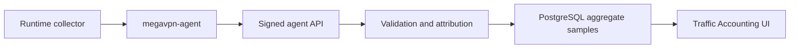

# Traffic Accounting

**Release:** `7.1.1.6`

Traffic accounting stores aggregate traffic counters for operational audit,
capacity planning and incident diagnostics. It is not packet capture and it is
not content logging.

## Data Boundary

The Control Plane stores:

- node, instance, service access and client references when the agent can
  attribute the sample;
- bucket start/end time;
- protocol and direction labels;
- received/transmitted bytes;
- received/transmitted packets;
- flow count;
- small collector metadata.

The Control Plane does not store:

- packet payloads;
- URLs;
- HTTP headers or bodies;
- DNS query names;
- TLS session contents;
- full per-destination browsing history.

## Storage Model

Traffic samples are stored in PostgreSQL table
`traffic_accounting_samples`. Each row is one aggregate bucket. The agent
submits a deterministic `sample_key`, or the Control Plane derives one from the
node, attribution fields and bucket timestamps. Re-sending the same sample is
idempotent and updates the aggregate row instead of duplicating it.

Default retention is 180 days. Overview and export queries always enforce the
retention cutoff. Ingest also runs bounded batch pruning for rows older than
the retention window, so cleanup work is capped per request and any large
backlog is drained over subsequent ingests.

## API Model

Operator read API:

```text
GET /api/v1/traffic/accounting?limit=250
GET /api/v1/traffic/accounting?from=2026-07-01&to=2026-07-06&protocol=wireguard&client_id=<uuid>&node_id=<uuid>
```

The read response includes summary metadata for retention operations:

- `retention_cutoff`: oldest timestamp returned by overview/export reads;
- `expired_sample_count`: rows older than cutoff that are waiting for physical
  batched cleanup;
- `prune_batch_size` and `prune_batches_per_ingest`: cleanup bounds for one
  ingest request;
- `max_prune_per_ingest`: maximum expired rows the control plane attempts to
  delete during one ingest.

The same response also includes `collectors`: derived status rows grouped by
node, collector source and protocol for the selected retained dataset. Each row
contains `status`, `last_received_at`, `last_received_age_seconds`,
`last_bucket_end`, sample/client counts, expected/observed instance counts,
missing instance count and aggregate byte counters. Status is `active` when
samples arrived within the normal reporting window, `degraded` when the stream
is late or only partially observed, `missing` when an expected collector stream
has no samples, and `inactive` when an observed stream has been silent long
enough to require operator validation.

Expected collector coverage is derived from enabled managed
Xray/WireGuard/OpenVPN instances in `active` or `degraded` state whose applied
runtime revision enables traffic accounting. Legacy rows without an applied
revision fall back to the current revision. Expected rows are joined with
retained samples by node, source and protocol so operators can see expected,
observed and missing streams in one table. Expected coverage is intentionally
omitted under `client_id` filters because a per-client slice cannot prove that a
whole instance stream is missing.
Current agents report aggregate samples when counters advance; an expected row
with no retained samples can therefore mean no observed traffic yet, a collector
configuration problem or a node-side reporting failure. Treat `missing` as a
diagnostic signal that requires live-node validation, not as standalone proof
of packet loss.

The response also includes `clients`: server-side aggregate usage counters for
attributed client accounts in the same retained/filter dataset. These counters
are computed over the full retention-scoped query, not from the recent rows
shown at the bottom of the UI. Each row includes client id/name, sample count,
node/instance/protocol coverage, rx/tx bytes, packets, flow count, first bucket
and last bucket/received timestamps.

Operator CSV export API:

```text
GET /api/v1/traffic/accounting/export?limit=10000
GET /api/v1/traffic/accounting/export?from=2026-07-01T00:00:00Z&to=2026-07-06T23:59:59Z&protocol=wireguard
```

Required permission: `traffic.read`.

The overview and CSV export endpoints accept the same read filters: `limit`,
`from`, `to`, `client_id`, `node_id` and `protocol`. The overview endpoint
caps recent rows to the operator-safe read maximum; CSV export keeps the
larger export cap. Invalid UUID filters and inverted time ranges fail closed.
Each CSV export creates a `traffic.accounting.export` audit event with the
operator id and exported retained-row count. Row contents and payload metadata
are not copied into the audit event.

Agent ingest API:

```text
POST /agent/traffic/accounting
```

The agent endpoint uses the same bearer-token and signed-message model as
runtime reports. Invalid node, instance, service-access or client bindings are
rejected before storage.

## Operational Workflow



The Traffic Accounting UI is organized as top-level tabs:

- `Overview`: aggregate counters and no-data diagnostics;
- `Clients`: per-client usage;
- `Collectors`: agent counter streams and expected/observed coverage;
- `Samples`: raw retained aggregate rows;
- `Export`: report filters and CSV download.

The report-filter form lives in the `Export` tab. Reads are server-side, use
the same `traffic.read` permission, enforce retention cutoff and stay capped by
endpoint type. CSV responses set `Cache-Control: no-store`. Time filters accept
RFC3339 or `YYYY-MM-DD`. The overview cards show operator-facing counters:
total traffic, received/sent bytes, retained samples, clients, nodes, collector
streams and retention. Backend prune internals are intentionally not shown on
the primary operator screen.

When no samples are retained for the selected dataset, the UI shows one
diagnostic no-data state instead of empty tables. The state points the operator
to collector streams, managed Xray/WireGuard/OpenVPN services and the fact that
the first agent read establishes a baseline before later reads submit deltas.

The UI exposes the same export filters as form controls:

- date range: `from` and `to`;
- protocol;
- client;
- node;
- row limit.

Changing a filter reloads the overview, collector-status table, per-client
counters and recent-sample table from the backend when rows exist. CSV export
uses the same selected values against the retained dataset, not a browser-side
subset of already loaded rows.

## Observability Evidence

The minimum MVP evidence set is:

- per-client usage counters in `Traffic Accounting -> Per-client usage counters`;
- collector coverage in `Traffic Accounting -> Collector status`;
- operator auth/audit events in `Audit`, including login/logout, config changes
  and `traffic.accounting.export`;
- job evidence in `Jobs`: status, result payload and execution logs;
- node health/runtime drift in node diagnostics and runtime state views;
- retention metadata: `retention_days`, `retention_cutoff`,
  `expired_sample_count`, prune batch size and max prune per ingest.

## Runtime Collectors

Managed Xray specs can enable `traffic_accounting_enabled`. When enabled, the
rendered Xray config includes:

- `stats` and user uplink/downlink policy;
- a `dokodemo-door` Stats API inbound bound to `127.0.0.1`;
- an `api` routing rule that is not reachable from the public service endpoint.

`megavpn-agent` queries local Xray Stats API counters, keeps absolute counter
baselines in memory and submits only deltas as aggregate buckets. Xray `uplink`
is stored as `rx_bytes`; Xray `downlink` is stored as `tx_bytes`.

Existing Xray instances must be re-applied after upgrading so the node receives
the updated config with the loopback Stats API.

Managed WireGuard instances are collected through local `wg show <interface>
transfer` counters. The agent maps counters to client metadata using the
WireGuard public key and client address stored on `service_accesses`. Managed
WireGuard configs also render non-secret attribution comments for diagnostics.

Managed OpenVPN instances render:

- `status-version 2`;
- `status <managed runtime dir>/status.log 60`;
- `ifconfig-pool-persist <managed runtime dir>/ipp.txt`.

The agent parses the local status file, aggregates duplicate common names and
maps samples back to `service_accesses` through
`openvpn_client_common_name`.

Existing OpenVPN/WireGuard instances should be re-applied after upgrading so
the node receives the managed status path and peer attribution comments. Raw
operator-supplied OpenVPN configs are not modified automatically; add an
explicit `status` directive if accounting is required for a raw config.

## Security Notes

- Accounting samples are append/update aggregate records, not raw traffic.
- Operators need `traffic.read`; no interactive operator write API is exposed.
- Agent writes are node-scoped and signed.
- Invalid references fail closed.
- Retention cleanup is automatic on ingest and bounded to avoid large blocking
  deletes.

## Current Limitation And Next Work

The current collectors store byte aggregates, not per-destination flow logs.
The current storage path has query/export indexes and bounded retention
cleanup, but still needs live-node validation evidence across Xray, WireGuard
and OpenVPN under reconnect/restart scenarios. Declarative partitioning or
cold archive tables should be added only if real cardinality requires it.
