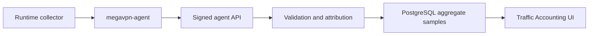

# Traffic Accounting

**Release:** `7.1.0.2`

Traffic accounting stores aggregate traffic counters for operational audit,
capacity planning and incident diagnostics. It is not packet capture and it is
not content logging.

## Data Boundary

The Control Plane stores:

- node, instance, service access and client references when the agent can
  attribute the sample;
- bucket start/end time;
- protocol and direction labels;
- received/transmitted bytes;
- received/transmitted packets;
- flow count;
- small collector metadata.

The Control Plane does not store:

- packet payloads;
- URLs;
- HTTP headers or bodies;
- DNS query names;
- TLS session contents;
- full per-destination browsing history.

## Storage Model

Traffic samples are stored in PostgreSQL table
`traffic_accounting_samples`. Each row is one aggregate bucket. The agent
submits a deterministic `sample_key`, or the Control Plane derives one from the
node, attribution fields and bucket timestamps. Re-sending the same sample is
idempotent and updates the aggregate row instead of duplicating it.

Default retention is 180 days. Every ingest path prunes samples older than the
retention window.

## API Model

Operator read API:

```text
GET /api/v1/traffic/accounting?limit=250
```

Required permission: `traffic.read`.

Agent ingest API:

```text
POST /agent/traffic/accounting
```

The agent endpoint uses the same bearer-token and signed-message model as
runtime reports. Invalid node, instance, service-access or client bindings are
rejected before storage.

## Operational Workflow



## Security Notes

- Accounting samples are append/update aggregate records, not raw traffic.
- Operators need `traffic.read`; no interactive operator write API is exposed.
- Agent writes are node-scoped and signed.
- Invalid references fail closed.
- Retention cleanup is automatic on ingest.

## Current Limitation

This release adds the Control Plane storage/API/UI foundation. Runtime-specific
collectors must be enabled per protocol after collector validation on real
nodes. Xray/VLESS should use Xray Stats API counters; OpenVPN and WireGuard
should use interface/client counters mapped through service access metadata.
