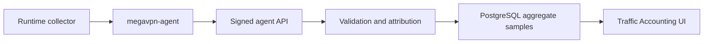

# Traffic Accounting

**Release:** `7.1.0.5`

Traffic accounting stores aggregate traffic counters for operational audit,
capacity planning and incident diagnostics. It is not packet capture and it is
not content logging.

## Data Boundary

The Control Plane stores:

- node, instance, service access and client references when the agent can
  attribute the sample;
- bucket start/end time;
- protocol and direction labels;
- received/transmitted bytes;
- received/transmitted packets;
- flow count;
- small collector metadata.

The Control Plane does not store:

- packet payloads;
- URLs;
- HTTP headers or bodies;
- DNS query names;
- TLS session contents;
- full per-destination browsing history.

## Storage Model

Traffic samples are stored in PostgreSQL table
`traffic_accounting_samples`. Each row is one aggregate bucket. The agent
submits a deterministic `sample_key`, or the Control Plane derives one from the
node, attribution fields and bucket timestamps. Re-sending the same sample is
idempotent and updates the aggregate row instead of duplicating it.

Default retention is 180 days. Every ingest path prunes samples older than the
retention window.

## API Model

Operator read API:

```text
GET /api/v1/traffic/accounting?limit=250
```

Operator CSV export API:

```text
GET /api/v1/traffic/accounting/export?limit=10000
GET /api/v1/traffic/accounting/export?from=2026-07-01T00:00:00Z&to=2026-07-06T23:59:59Z&protocol=wireguard
```

Required permission: `traffic.read`.

Agent ingest API:

```text
POST /agent/traffic/accounting
```

The agent endpoint uses the same bearer-token and signed-message model as
runtime reports. Invalid node, instance, service-access or client bindings are
rejected before storage.

## Operational Workflow



The Traffic Accounting UI provides `Export CSV` for audit handoff. Export is
read-only, uses the same `traffic.read` permission, sets `Cache-Control:
no-store` and is capped server-side. Export filters support `limit`, `from`,
`to`, `client_id`, `node_id` and `protocol`. Time filters accept RFC3339 or
`YYYY-MM-DD`.

## Runtime Collectors

Managed Xray specs can enable `traffic_accounting_enabled`. When enabled, the
rendered Xray config includes:

- `stats` and user uplink/downlink policy;
- a `dokodemo-door` Stats API inbound bound to `127.0.0.1`;
- an `api` routing rule that is not reachable from the public service endpoint.

`megavpn-agent` queries local Xray Stats API counters, keeps absolute counter
baselines in memory and submits only deltas as aggregate buckets. Xray `uplink`
is stored as `rx_bytes`; Xray `downlink` is stored as `tx_bytes`.

Existing Xray instances must be re-applied after upgrading so the node receives
the updated config with the loopback Stats API.

Managed WireGuard instances are collected through local `wg show <interface>
transfer` counters. The agent maps counters to client metadata using the
WireGuard public key and client address stored on `service_accesses`. Managed
WireGuard configs also render non-secret attribution comments for diagnostics.

Managed OpenVPN instances render:

- `status-version 2`;
- `status <managed runtime dir>/status.log 60`;
- `ifconfig-pool-persist <managed runtime dir>/ipp.txt`.

The agent parses the local status file, aggregates duplicate common names and
maps samples back to `service_accesses` through
`openvpn_client_common_name`.

Existing OpenVPN/WireGuard instances should be re-applied after upgrading so
the node receives the managed status path and peer attribution comments. Raw
operator-supplied OpenVPN configs are not modified automatically; add an
explicit `status` directive if accounting is required for a raw config.

## Security Notes

- Accounting samples are append/update aggregate records, not raw traffic.
- Operators need `traffic.read`; no interactive operator write API is exposed.
- Agent writes are node-scoped and signed.
- Invalid references fail closed.
- Retention cleanup is automatic on ingest.

## Current Limitation And Next Work

The current collectors store byte aggregates, not per-destination flow logs.
The next development step is partitioned long-term retention and live-node
validation evidence across Xray, WireGuard and OpenVPN under reconnect/restart
scenarios.
