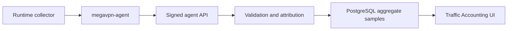

# Учет трафика

**Релиз:** `7.1.0.25`

Учет трафика хранит агрегированные счетчики для операционного аудита,
capacity planning и диагностики инцидентов. Это не packet capture и не
логирование содержимого пользовательского трафика.

## Граница данных

Control Plane хранит:

- ссылки на node, instance, service access и client, если агент может
  атрибутировать sample;
- начало и конец временного bucket;
- protocol и direction labels;
- принятые/переданные bytes;
- принятые/переданные packets;
- количество flows;
- небольшую collector metadata.

Control Plane не хранит:

- payload packets;
- URLs;
- HTTP headers или bodies;
- DNS query names;
- содержимое TLS sessions;
- полную историю посещенных destination.

## Модель хранения

Samples хранятся в PostgreSQL table `traffic_accounting_samples`. Каждая строка
- один агрегированный bucket. Agent передает deterministic `sample_key`, либо
Control Plane строит его из node, attribution fields и bucket timestamps.
Повторная отправка того же sample идемпотентна: строка обновляется, а не
дублируется.

Retention по умолчанию - 180 дней. Overview и export queries всегда применяют
retention cutoff. Ingest дополнительно запускает bounded batch pruning для
строк старше retention window, поэтому cleanup work ограничен на один request,
а большой backlog удаляется постепенно на следующих ingest.

## API

Operator read API:

```text
GET /api/v1/traffic/accounting?limit=250
GET /api/v1/traffic/accounting?from=2026-07-01&to=2026-07-06&protocol=wireguard&client_id=<uuid>&node_id=<uuid>
```

Read response включает summary metadata для retention operations:

- `retention_cutoff`: самый старый timestamp, который возвращают overview/export
  reads;
- `expired_sample_count`: строки старше cutoff, ожидающие physical batched
  cleanup;
- `prune_batch_size` и `prune_batches_per_ingest`: cleanup bounds для одного
  ingest request;
- `max_prune_per_ingest`: максимум expired rows, которые control plane пытается
  удалить за один ingest.

Этот же response включает `collectors`: derived status rows, сгруппированные по
node, collector source и protocol для выбранного retained dataset. Каждая строка
содержит `status`, `last_received_at`, `last_received_age_seconds`,
`last_bucket_end`, sample/client counts, expected/observed instance counts,
missing instance count и aggregate byte counters. Status равен `active`, если
samples пришли в нормальное reporting window, `degraded`, если stream
запаздывает или виден только частично, `missing`, если ожидаемый collector stream
не прислал samples, и `inactive`, если observed stream молчит достаточно долго
для operator validation.

Expected collector coverage строится из enabled managed Xray/WireGuard/OpenVPN
instances в статусе `active` или `degraded`, у которых applied runtime revision
включает traffic accounting. Legacy rows без applied revision fallback-ятся к
current revision. Эти expected rows объединяются с retained samples по node,
source и protocol, чтобы оператор видел expected, observed и missing streams в
одной таблице. Под `client_id` filter expected coverage намеренно не
показывается: per-client срез не может корректно доказать, что весь instance
stream missing.
Текущие agents отправляют aggregate samples, когда счетчики растут; поэтому
expected row без retained samples может означать отсутствие наблюдаемого трафика,
ошибку collector configuration или node-side reporting failure. Статус
`missing` - diagnostic signal для live-node validation, а не самостоятельное
доказательство потери traffic.

Response также включает `clients`: server-side aggregate usage counters по
атрибутированным client accounts для той же retained/filter выборки. Эти
counters считаются по всей retention-scoped выборке, а не по recent rows,
которые показаны внизу UI. Каждая строка содержит client id/name, sample count,
node/instance/protocol coverage, rx/tx bytes, packets, flow count, first bucket
и last bucket/received timestamps.

Operator CSV export API:

```text
GET /api/v1/traffic/accounting/export?limit=10000
GET /api/v1/traffic/accounting/export?from=2026-07-01T00:00:00Z&to=2026-07-06T23:59:59Z&protocol=wireguard
```

Требуемое permission: `traffic.read`.

Overview и CSV export endpoints принимают одинаковые read filters: `limit`,
`from`, `to`, `client_id`, `node_id` и `protocol`. Overview endpoint ограничивает
recent rows операторским read cap; CSV export использует больший export cap.
Неверные UUID filters и перевернутый time range fail-closed.
Каждый CSV export пишет audit event `traffic.accounting.export` с operator id и
количеством выгруженных retained rows. Содержимое строк и payload metadata в
audit event не копируются.

Agent ingest API:

```text
POST /agent/traffic/accounting
```

Agent endpoint использует тот же bearer-token и signed-message механизм, что и
runtime reports. Неверные node, instance, service-access или client bindings
отклоняются до записи в PostgreSQL.

## Workflow



Traffic Accounting UI организован через верхние вкладки:

- `Overview`: aggregate counters и no-data diagnostics;
- `Clients`: per-client usage;
- `Collectors`: agent counter streams и expected/observed coverage;
- `Samples`: raw retained aggregate rows;
- `Export`: report filters и CSV download.

Report-filter form живет во вкладке `Export`. Reads выполняются server-side,
используют тот же permission `traffic.read`, применяют retention cutoff и
ограничиваются cap конкретного endpoint-а. CSV responses отдают
`Cache-Control: no-store`. Time filters принимают RFC3339 или `YYYY-MM-DD`.
Overview cards показывают operator-facing counters: total traffic,
received/sent bytes, retained samples, clients, nodes, collector streams и
retention. Внутренние prune-поля backend на основном operator screen намеренно
не показываются.

Если для выбранного dataset нет retained samples, UI показывает одно
диагностическое no-data состояние вместо пустых таблиц. Оно направляет
оператора к collector streams, managed Xray/WireGuard/OpenVPN services и
объясняет, что первый agent read ставит baseline, а следующие reads отправляют
дельты после роста counters.

UI показывает те же export filters как form controls:

- date range: `from` и `to`;
- protocol;
- client;
- node;
- row limit.

Изменение фильтра перезагружает overview, collector-status table, per-client
counters и recent-sample table с backend-а, когда есть строки. CSV export
использует те же выбранные значения по retained dataset, а не browser-side
subset уже загруженных строк.

## Observability evidence

Минимальный MVP evidence набор:

- per-client usage counters в `Traffic Accounting -> Per-client usage counters`;
- collector coverage в `Traffic Accounting -> Collector status`;
- operator auth/audit events в `Audit`, включая login/logout, config changes и
  `traffic.accounting.export`;
- job evidence в `Jobs`: status, result payload и execution logs;
- node health/runtime drift в node diagnostics и runtime state views;
- retention metadata: `retention_days`, `retention_cutoff`,
  `expired_sample_count`, prune batch size и max prune per ingest.

## Runtime collectors

Managed Xray specs могут включать `traffic_accounting_enabled`. В этом случае
rendered Xray config содержит:

- `stats` и policy для user uplink/downlink counters;
- `dokodemo-door` Stats API inbound, привязанный только к `127.0.0.1`;
- `api` routing rule, недоступный с публичного service endpoint.

`megavpn-agent` читает локальные Xray Stats API counters, держит baseline
абсолютных счетчиков в памяти и отправляет только дельты как aggregate buckets.
Xray `uplink` записывается как `rx_bytes`; Xray `downlink` записывается как
`tx_bytes`.

Существующие Xray instances нужно повторно применить после upgrade, чтобы node
получила обновленный config с loopback Stats API.

Managed WireGuard instances собираются через локальные счетчики
`wg show <interface> transfer`. Agent сопоставляет counters с клиентом по
WireGuard public key и client address, которые уже хранятся в metadata
`service_accesses`. Управляемые WireGuard configs также рендерят non-secret
attribution comments для диагностики.

Managed OpenVPN instances рендерят:

- `status-version 2`;
- `status <managed runtime dir>/status.log 60`;
- `ifconfig-pool-persist <managed runtime dir>/ipp.txt`.

Agent парсит локальный status file, агрегирует duplicate common names и
сопоставляет samples с `service_accesses` через `openvpn_client_common_name`.

Существующие OpenVPN/WireGuard instances нужно повторно применить после
upgrade, чтобы node получила managed status path и peer attribution comments.
Raw operator-supplied OpenVPN configs не меняются автоматически; если accounting
нужен для raw config, добавь явный `status` directive.

## Security notes

- Accounting samples - агрегаты, а не raw traffic.
- Оператору нужен `traffic.read`; интерактивного operator write API нет.
- Agent writes ограничены node identity и подписываются.
- Неверные ссылки fail-closed.
- Retention cleanup автоматический на ingest и bounded, чтобы не запускать
  большие блокирующие deletes.

## Текущее ограничение и следующий этап

Текущие collectors хранят byte aggregates, а не per-destination flow logs.
Storage path уже имеет indexes для query/export и bounded retention cleanup, но
нужен live-node validation evidence по Xray, WireGuard и OpenVPN при
reconnect/restart сценариях. Declarative partitioning или cold archive tables
нужно добавлять только если реальная cardinality этого потребует.
