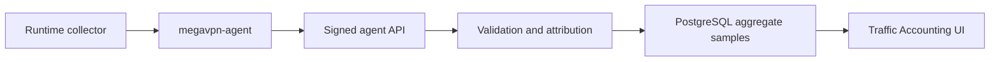

# Учет трафика

**Релиз:** `7.1.0.6`

Учет трафика хранит агрегированные счетчики для операционного аудита,
capacity planning и диагностики инцидентов. Это не packet capture и не
логирование содержимого пользовательского трафика.

## Граница данных

Control Plane хранит:

- ссылки на node, instance, service access и client, если агент может
  атрибутировать sample;
- начало и конец временного bucket;
- protocol и direction labels;
- принятые/переданные bytes;
- принятые/переданные packets;
- количество flows;
- небольшую collector metadata.

Control Plane не хранит:

- payload packets;
- URLs;
- HTTP headers или bodies;
- DNS query names;
- содержимое TLS sessions;
- полную историю посещенных destination.

## Модель хранения

Samples хранятся в PostgreSQL table `traffic_accounting_samples`. Каждая строка
- один агрегированный bucket. Agent передает deterministic `sample_key`, либо
Control Plane строит его из node, attribution fields и bucket timestamps.
Повторная отправка того же sample идемпотентна: строка обновляется, а не
дублируется.

Retention по умолчанию - 180 дней. Overview и export queries всегда применяют
retention cutoff. Ingest дополнительно запускает bounded batch pruning для
строк старше retention window, поэтому cleanup work ограничен на один request,
а большой backlog удаляется постепенно на следующих ingest.

## API

Operator read API:

```text
GET /api/v1/traffic/accounting?limit=250
```

Operator CSV export API:

```text
GET /api/v1/traffic/accounting/export?limit=10000
GET /api/v1/traffic/accounting/export?from=2026-07-01T00:00:00Z&to=2026-07-06T23:59:59Z&protocol=wireguard
```

Требуемое permission: `traffic.read`.

Agent ingest API:

```text
POST /agent/traffic/accounting
```

Agent endpoint использует тот же bearer-token и signed-message механизм, что и
runtime reports. Неверные node, instance, service-access или client bindings
отклоняются до записи в PostgreSQL.

## Workflow



Traffic Accounting UI дает кнопку `Export CSV` для audit handoff. Export
read-only, использует тот же permission `traffic.read`, отдает `Cache-Control:
no-store` и ограничен server-side cap. Export filters поддерживают `limit`,
`from`, `to`, `client_id`, `node_id` и `protocol`. Time filters принимают
RFC3339 или `YYYY-MM-DD`.

## Runtime collectors

Managed Xray specs могут включать `traffic_accounting_enabled`. В этом случае
rendered Xray config содержит:

- `stats` и policy для user uplink/downlink counters;
- `dokodemo-door` Stats API inbound, привязанный только к `127.0.0.1`;
- `api` routing rule, недоступный с публичного service endpoint.

`megavpn-agent` читает локальные Xray Stats API counters, держит baseline
абсолютных счетчиков в памяти и отправляет только дельты как aggregate buckets.
Xray `uplink` записывается как `rx_bytes`; Xray `downlink` записывается как
`tx_bytes`.

Существующие Xray instances нужно повторно применить после upgrade, чтобы node
получила обновленный config с loopback Stats API.

Managed WireGuard instances собираются через локальные счетчики
`wg show <interface> transfer`. Agent сопоставляет counters с клиентом по
WireGuard public key и client address, которые уже хранятся в metadata
`service_accesses`. Управляемые WireGuard configs также рендерят non-secret
attribution comments для диагностики.

Managed OpenVPN instances рендерят:

- `status-version 2`;
- `status <managed runtime dir>/status.log 60`;
- `ifconfig-pool-persist <managed runtime dir>/ipp.txt`.

Agent парсит локальный status file, агрегирует duplicate common names и
сопоставляет samples с `service_accesses` через `openvpn_client_common_name`.

Существующие OpenVPN/WireGuard instances нужно повторно применить после
upgrade, чтобы node получила managed status path и peer attribution comments.
Raw operator-supplied OpenVPN configs не меняются автоматически; если accounting
нужен для raw config, добавь явный `status` directive.

## Security notes

- Accounting samples - агрегаты, а не raw traffic.
- Оператору нужен `traffic.read`; интерактивного operator write API нет.
- Agent writes ограничены node identity и подписываются.
- Неверные ссылки fail-closed.
- Retention cleanup автоматический на ingest и bounded, чтобы не запускать
  большие блокирующие deletes.

## Текущее ограничение и следующий этап

Текущие collectors хранят byte aggregates, а не per-destination flow logs.
Storage path уже имеет indexes для query/export и bounded retention cleanup, но
нужен live-node validation evidence по Xray, WireGuard и OpenVPN при
reconnect/restart сценариях. Declarative partitioning или cold archive tables
нужно добавлять только если реальная cardinality этого потребует.
