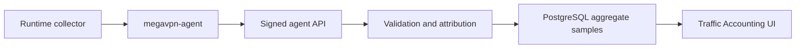

# Учет трафика

**Релиз:** `7.1.0.2`

Учет трафика хранит агрегированные счетчики для операционного аудита,
capacity planning и диагностики инцидентов. Это не packet capture и не
логирование содержимого пользовательского трафика.

## Граница данных

Control Plane хранит:

- ссылки на node, instance, service access и client, если агент может
  атрибутировать sample;
- начало и конец временного bucket;
- protocol и direction labels;
- принятые/переданные bytes;
- принятые/переданные packets;
- количество flows;
- небольшую collector metadata.

Control Plane не хранит:

- payload packets;
- URLs;
- HTTP headers или bodies;
- DNS query names;
- содержимое TLS sessions;
- полную историю посещенных destination.

## Модель хранения

Samples хранятся в PostgreSQL table `traffic_accounting_samples`. Каждая строка
- один агрегированный bucket. Agent передает deterministic `sample_key`, либо
Control Plane строит его из node, attribution fields и bucket timestamps.
Повторная отправка того же sample идемпотентна: строка обновляется, а не
дублируется.

Retention по умолчанию - 180 дней. Каждый ingest path автоматически удаляет
старые samples за пределами retention window.

## API

Operator read API:

```text
GET /api/v1/traffic/accounting?limit=250
```

Требуемое permission: `traffic.read`.

Agent ingest API:

```text
POST /agent/traffic/accounting
```

Agent endpoint использует тот же bearer-token и signed-message механизм, что и
runtime reports. Неверные node, instance, service-access или client bindings
отклоняются до записи в PostgreSQL.

## Workflow



## Security notes

- Accounting samples - агрегаты, а не raw traffic.
- Оператору нужен `traffic.read`; интерактивного operator write API нет.
- Agent writes ограничены node identity и подписываются.
- Неверные ссылки fail-closed.
- Retention cleanup автоматический на ingest.

## Текущее ограничение

Этот релиз добавляет foundation в Control Plane: storage/API/UI. Runtime-specific
collectors нужно включать отдельно по каждому протоколу после validation на
реальных nodes. Для Xray/VLESS целевой источник - Xray Stats API counters; для
OpenVPN и WireGuard - interface/client counters, связанные с service access
metadata.
